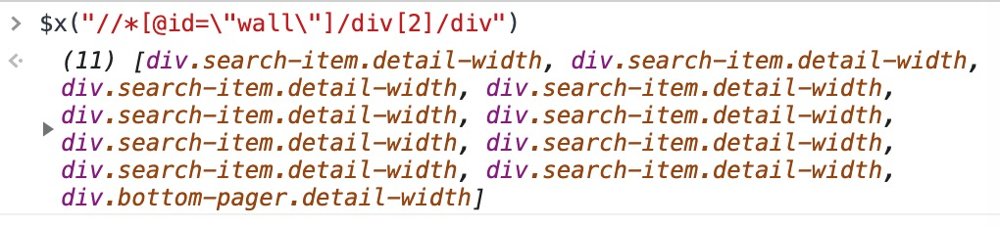
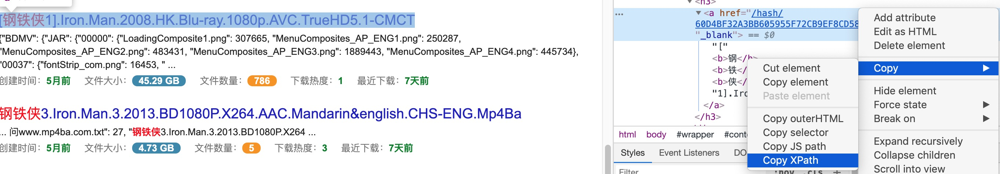
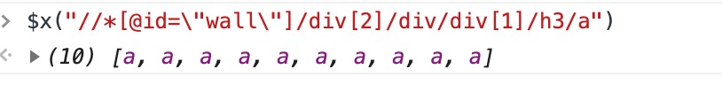
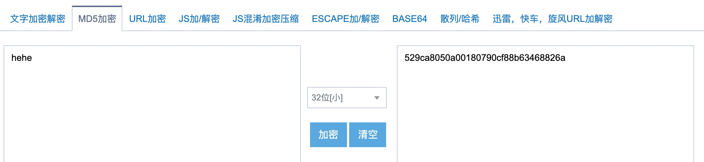
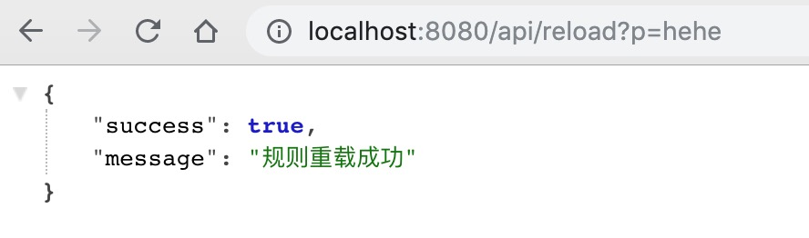

## 自定义配置
配置文件在`main/resources/config.properties`下，修改配置后需要重新启动项目

```
#管理密码 32位小写MD5值
admin.password.md5=

#规则json文件地址（支持URL和本地路径）本地路径以main/resources为根目录
#修改规则后 访问重载规则API可热刷新配置
//rule.json.uri=rule.json
rule.json.uri=https://raw.githubusercontent.com/dengyuhan/magnetW/master/src/main/resources/rule.json

#搜索框占位文字
search.placeholder=钢铁侠
#版本号链接
version.link=
#是否开启预加载 开启后会异步缓存下一页
preload.enabled=true

#是否开启tracker服务器 开启后会在新增一列拼接了tracker服务器列表的磁力链接
trackers.enabled=true
#自动更新tracker列表的间隔时间（单位:小时）
#列表来自https://raw.githubusercontent.com/ngosang/trackerslist/master/trackers_all.txt
trackers.update.interval.hour=24

#不蒜子统计
#是否开启
busuanzi.enabled=false
#是否在页面上显示(当busuanzi.enabled=true生效)
busuanzi.show=false

#是否忽略需要代理才能访问的源站
proxy.ignore=true
```

## 规则
规则Json支持本地文件和网络文件，基于XPath

```
{
    "site": "CiLiWiKi",			              //网站名称
    "proxy": false,                           //该网站是否需要代理才能访问
    "group": "//*[@id=\"wall\"]/div[2]/div",  //Item容器XPath
    "magnet": "./div[1]/h3/a/@href",          //磁力链XPath
    "name": "./div[1]/h3/a",                  //显示名称XPath
    "size": "./div[3]/span[2]/b",             //文件大小XPath
    "date": "./div[3]/span[5]/b",             //创建时间XPath
    "hot": "./div[3]/span[4]/b",              //人气热度XPath
    "url": "https://www.ciliwiki.com",        //网站首页
    "paths": { 								  //搜索路径
      "preset": "/search/%s-%d.html",         //默认排序
      "time": "/search/%s-%d-time.html",      //时间排序
      "size": "/search/%s-%d-size.html",      //大小排序
      "hot": "/search/%s-%d-views.html"       //人气排序
    }
  }
```

## 获取XPath
#### group
选中列表其中一个Item，右键元素即可复制这个Item的XPath，示例中选中的是第5个，所以XPath是`//*[@id="wall"]/div[2]/div[5]`，把索引去掉并转义，所以最终是`//*[@id=\"wall\"]/div[2]/div`


控制台用`$x("//*[@id=\"wall\"]/div[2]/div")`测试，打印出列表说明XPath正确



#### magnet | name | size | date | hot
以显示名称为例，选中包含名称的元素，复制出来的XPath是这样`//*[@id="wall"]/div[2]/div[5]/div[1]/h3/a`，因为每个属性都是在group下查找的，所以要把**group的部分去掉**在前面加`.`，**name**的XPath应该是`./div[1]/h3/a`





## 管理API
可以去[在线MD5](http://tool.chinaz.com/tools/md5.aspx)将密码转成32位小写，然后在`config.properties`中填入MD5，即可访问管理API



```
admin.password.md5=529ca8050a00180790cf88b63468826a
```




#### 重载规则

```
/api/reload?p=[管理密码]
```
#### 清除缓存

```
/api/clear-cache?p=[管理密码]
```

## 数据API
支持返回Json的API，以扩展其它平台

#### 获取源站列表
```
api/source
```

#### 搜索
```
api/search?source=[源站名称]&keyword=[关键字]&sort=[排序类型]&page=[页码]
```