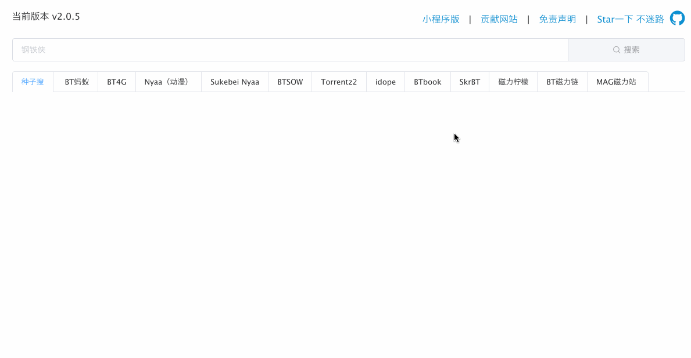
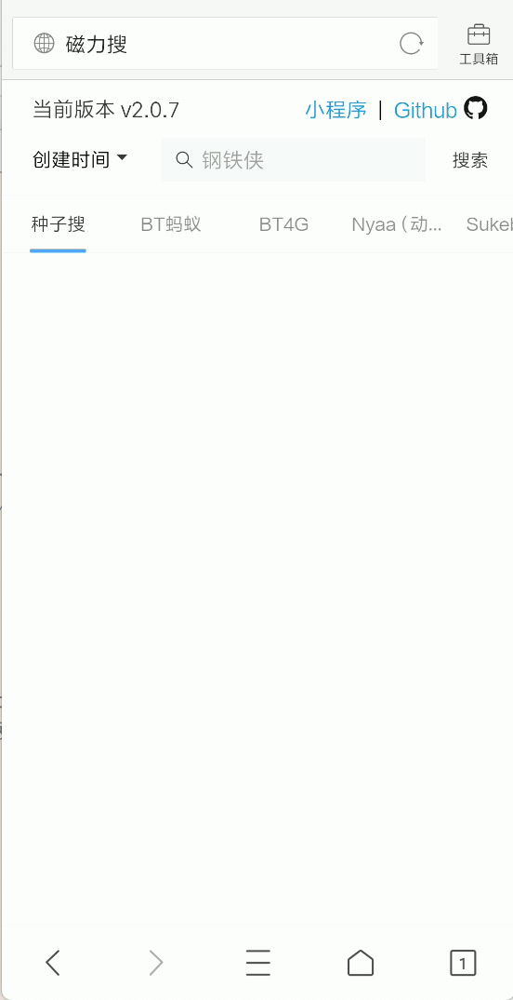

 
[[中文文档]](http://magnetw.app/)

## 简介
`magnetW`基于[magnetX](https://github.com/youusername/magnetX)的规则原理，将各个磁力站的搜索结果统一格式化

## 安装
从[Github Releases](https://github.com/dengyuhan/magnetW/releases)下载对应平台

或者

从[文档页](http://magnetw.app/)下载对应平台

## 截图

## 免责声明
本应用开源且免费，仅用于爬虫技术交流学习，搜索结果均来自源站，亦不承担任何责任

## 版权说明
* 项目中所使用的图标分别来自[@玥月](https://www.iconfont.cn/user/detail?uid=8898)、[@qqavh147](https://www.iconfont.cn/user/detail?uid=158352)、[@Asam](https://www.iconfont.cn/user/detail?uid=600186)
* 项目中规则原理来自[magnetX](https://github.com/youusername/magnetX)

## 注意事项
本项目没有群组，代码托管只有Github，其它地址分发的都有可能存在风险，请仔细辨别

## 开源协议
项目遵循GNU General Public License v3.0，如果要修改源码二次开发还需遵守以下协议：

1. 如果要在网络上分发，那么必须开源
2. 不能以盈利为目的，不能插入任何形式的广告
3. 注明原项目出处
4. 继承相同协议